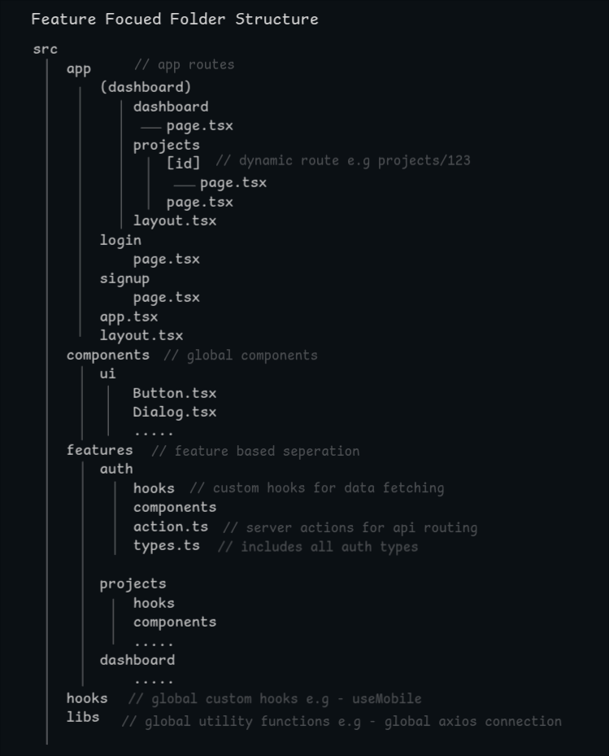

# RBAC Dashboard Client

Welcome to the frontend of dashboard for Role-Based Access Control (RBAC) system. This dashboard is built to help manage projects, assignments, and tasks with clear role-based actions.

## Tech Stack

Here are the main tools and libraries used to build the client:

- **Next.js** - React framework for routing and control
- **Tailwind CSS** - classes based styling
- **Shadcn UI & Base UI** - Pre build UI components
- **Axios** - Client for communicating with the backend APIs
- **Recharts** - Charts components, used for project visual analytics

## Folder Structure

Below is a visual layout of the project's folder structure:



## Getting Started

Follow these instructions to run the client locally:

### 1. Clone Repository

Open your terminal and clone the repo:

```bash
https://github.com/isayan24/RBAC-Dashboard-client.git

```

### 2. Install Dependencies

Then in the directory run:

```bash
npm install
```

### 3. Set Up Environment Variables

Create a file named `.env` in the root of the `client` folder and configure your API server URL:

```env
BACKEND_API=http://localhost:5000/api
```

### 4. Start the Development Server

Run the development command:

```bash
npm run dev
```

Now, open [http://localhost:3000](http://localhost:3000) in the browser to see the running application
